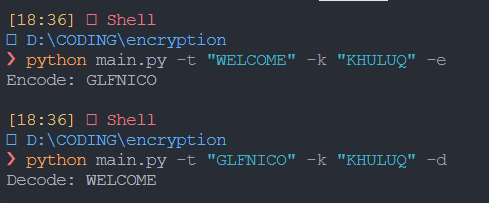

# Vigenère cipher

### Penjelasan `Vigenère cipher`

`Vigenère Cipher` adalah sebuah metode enkripsi klasik yang digunakan untuk mengamankan pesan dengan menggabungkan pesan teks biasa (plaintext) dengan kunci enkripsi. Metode ini ditemukan oleh Blaise de Vigenère pada `abad ke-16` dan digunakan secara luas selama berabad-abad sebelum munculnya teknik enkripsi modern.

### Penjelasan Code Bagian `generateKey()`

```python
def generateKey(string, key):
    key = list(key)
    if len(string) == len(key):
        return key
    else:
        for i in range(len(string) - len(key)):
            key.append(key[i % len(key)])
    return "".join(key)
```

Melihat dari penjelasan sang penemu bahwa `Vigenère Cipher` memiliki `Kunci Enkripsi (Key)` yang mana cara kerjanya adalah key akan dibuat sama dengan panjang dari `text` yang akan di `encrypt`.

#### Contoh :

kunci enkripsi adalah "KEY". maka nilai "KEY" akan diulang - ulang sampai sesuai dengan kalimat yang akan di encrpt `(key = "KEY" & text = "KHULUQ") = "KEYKEY"`.

### Penjelasan Code Bagian `encodeText()`

```python
def encodeText(string, key):
    temporaryEncode = []
    for i in range(len(string)):
        x = (ord(string[i]) + ord(key[i])) % 26
        x += ord('A')
        temporaryEncode.append(chr(x))
    return "".join(temporaryEncode)
```

Programm yang paling pentinga adalah pada bagian :

```python
        x = (ord(string[i]) + ord(key[i])) % 26
        x += ord('A')
```

`ord(string[i]) + ord(key[i])` menjumlahkan nilai ASCII dari karakter teks dan karakter kunci. dan setelah itu dilakukanlah pengambilan modulo 26 ( `% 26` ). Hal ini dilakukan untuk memastikan bahwa hasilnya tetap dalam jangkauan `0 hingga 26`.

`x += ord('A')` menambahkan nilai ASCII dari karakter 'A' pada hasil modulo sebelumnya.

### Penjelasan Code Bagian `decodeText()`

```python
def decodeText(string, key):
    temporaryDecode = []
    for i in range(len(string)):
        x = (ord(string[i]) - ord(key[i]) + 26) % 26
        x += ord('A')
        temporaryDecode.append(chr(x))
    return "".join(temporaryDecode)
```

Sama seperti pada bagian fungsi `encodeText()` point pentingnya terdapat pada bagian :

```python
        x = (ord(string[i]) - ord(key[i]) + 26) % 26
        x += ord('A')
```

`(ord(string[i]) - ord(key[i]) + 26)` mengurangkan nilai ASCII karakter kunci dari nilai ASCII karakter teks, lalu ditambakannya nilai 26.Penambahan 26 dilakukan untuk memastikan bahwa hasilnya selalu positif atau nol,dan setelah itu dilakukanlah pengambilan modulo 26 lagi ( `% 26` ).

`x += ord('A')` menambahkan nilai ASCII dari karakter 'A' pada hasil modulo sebelumnya.

### Usage Program

###### Running Encrypt program

```bash
python main.py -t "WELCOME" -k "KHULUQ" -e
```

###### Results

```bash
Encode: GLFNICO
```

###### Running Dekript program

```bash
python main.py -t "GLFNICO" -k "KHULUQ" -d
```

###### Results

```bash
Decode: WELCOME
```

### Prove of Running Code


